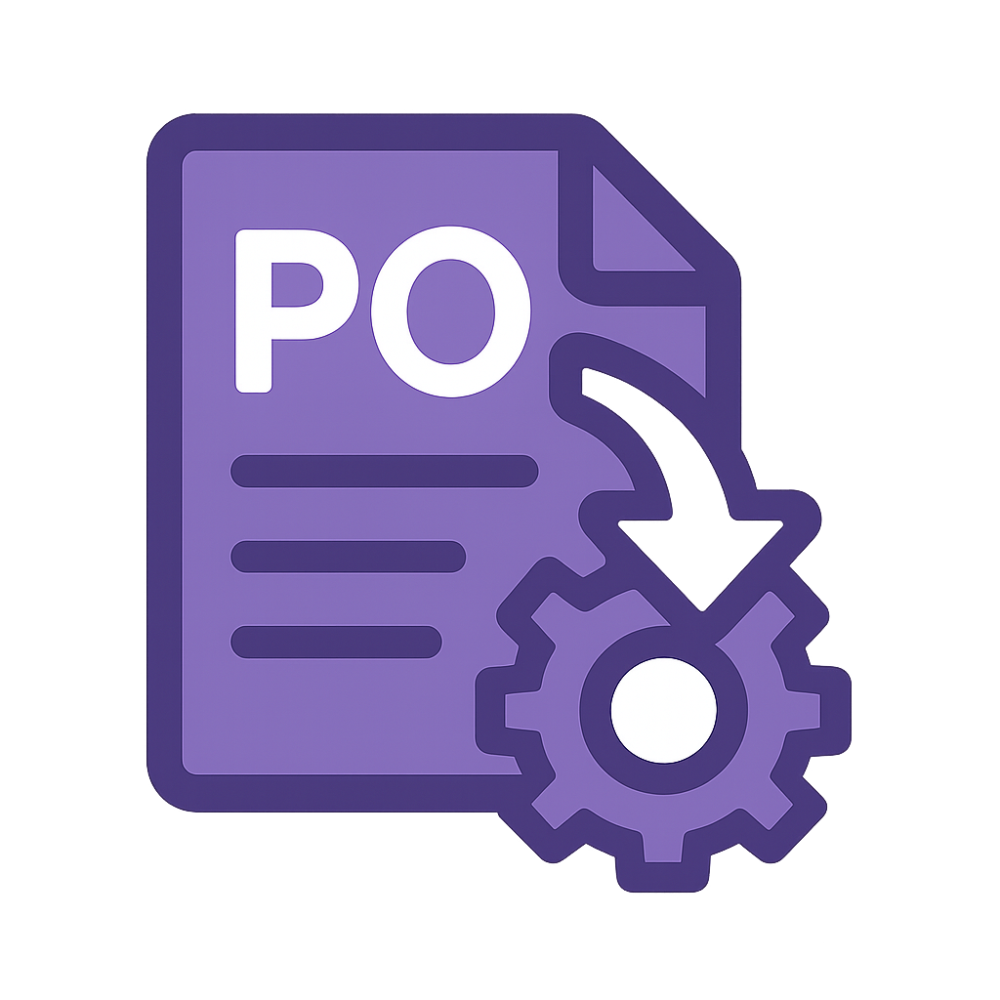

# PO Formatter

A standalone application that formats Purchase Order (PO) Excel files for various vendor systems.



## Overview

PO Formatter is a portable, cross-platform application that helps you format purchase order data for different vendor ordering systems. No installation required - just run directly from your USB drive.

## Features

- **Multi-vendor Support**: Format purchase orders for multiple vendors
  - HorizonHobby/FastServe
  - Stephens International
  - HRP
  - AMAIN (with HOST, CSV, and tab-delimited formats)
  - Traxxas (with SKU format for both CSV and INV)
- **Portable**: Runs directly from a USB drive with no installation
- **Cross-platform**: Works on Windows and macOS
- **Smart Format Detection**: Automatically detects column names
- **Automatic PO Number Extraction**: Extracts PO numbers from filenames
- **Multiple Input Formats**: Supports both Excel and CSV input files

## Supported Vendor Formats

### HorizonHobby/FastServe
- Format: `PO# / SKU1 / Qty1 / SKU2 / Qty2 / ... / END / SkuCount`
- Output: Text file

### Stephens International
- Format: Text file with PO number, alternating SKU and quantity lines, END marker, and product count
- Output: Text file

### HRP
- Format: CSV or tab-delimited file with PART #, QTY, and WAREHOUSE(Optional) columns
- Output: CSV or tab-delimited text file

### AMAIN
- Formats: HOST file, CSV, or tab-delimited
- Output: Appropriate file format based on selection

### Traxxas
- Format: CSV with SKU and QTY columns
- Output: CSV or INV file

## Installation

### For End Users

No installation required! Simply download the latest release and run the executable:

- **Windows**: Download `PO_Formatter.exe` and run directly
- **macOS**: Download `PO_Formatter.app`, right-click, select "Open"

### For Developers

1. Clone the repository:
   ```
   git clone https://github.com/yourusername/po-formatter.git
   cd po-formatter
   ```

2. Create a virtual environment (recommended):
   ```
   python -m venv venv
   source venv/bin/activate  # On Windows: venv\Scripts\activate
   ```

3. Install dependencies:
   ```
   pip install -r requirements.txt
   ```

4. Run the application:
   ```
   python po_formatter.py
   ```

## Building from Source

The repository includes scripts to build a standalone executable:

1. Ensure you have PyInstaller installed:
   ```
   pip install pyinstaller
   ```

2. Run the build script:
   ```
   python build.py
   ```

3. Find the executable in the project root directory

## Usage

1. Start the application
2. Click "Browse..." to select your PO Excel or CSV file
3. Confirm the PO number (extracted from the filename)
4. Select the vendor format
5. Click "Process"
6. Choose where to save the formatted output file
7. Upload the formatted file to your vendor's ordering system

## License

This project is licensed under the MIT License - see the LICENSE file for details.

## Acknowledgments

- Built with PySide6 (Qt for Python)
- Uses pandas for Excel and CSV processing 